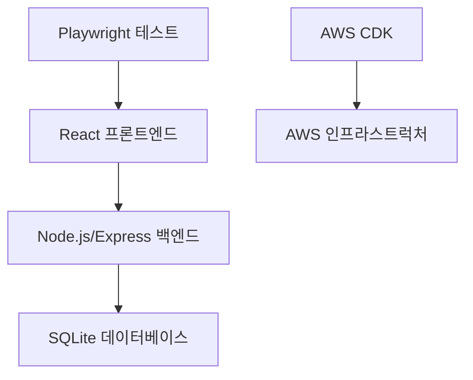

# 설계 문서

## 개요

Q-Social은 프론트엔드와 백엔드 모두에 TypeScript를 사용하는 간단한 풀스택 웹 애플리케이션으로 구축됩니다. 아키텍처는 단순성과 교육적 가치를 강조하여 스펙 기반 개발 원칙을 보여주는 2시간 워크샵에 완벽합니다.

## 아키텍처

### 시스템 아키텍처


### 기술 스택

**단일 언어 접근법: TypeScript**
- **프론트엔드**: React with TypeScript and Vite
- **백엔드**: Node.js with Express and TypeScript
- **데이터베이스**: SQLite (간단한 파일 기반 데이터베이스)
- **테스팅**: Playwright for end-to-end testing
- **인프라스트럭처**: AWS CDK with TypeScript

이 단일 언어 접근법은 인지적 부담을 줄이고 학생들이 언어 간 전환보다는 스펙 기반 개발 프로세스에 집중할 수 있게 합니다.

## 컴포넌트 및 인터페이스

### 프론트엔드 컴포넌트

#### App 컴포넌트
```typescript
interface Message {
  id: string;
  content: string;
  timestamp: string;
}

function App() {
  // 메시지 상태와 API 호출 관리
  // MessageForm과 MessageFeed 렌더링
}
```

#### MessageForm 컴포넌트
```typescript
interface MessageFormProps {
  onMessagePosted: (message: Message) => void;
}

function MessageForm({ onMessagePosted }: MessageFormProps) {
  // 입력 상태와 폼 제출 처리
  // 빈 메시지에 대한 기본 유효성 검사
}
```

#### MessageFeed 컴포넌트
```typescript
interface MessageFeedProps {
  messages: Message[];
}

function MessageFeed({ messages }: MessageFeedProps) {
  // 메시지 목록 표시
  // 비어있을 때 "아직 메시지가 없습니다" 표시
}
```

### 백엔드 API 엔드포인트

#### POST /api/messages
- 요청: `{ content: string }`
- 응답: `{ id: string, content: string, timestamp: string }`
- 유효성 검사: 비어있지 않은 내용, 최대 280자

#### GET /api/messages
- 응답: `{ messages: Message[] }`
- 최신순으로 정렬된 메시지 반환

## 데이터 모델

### 데이터베이스 스키마
```sql
CREATE TABLE messages (
    id TEXT PRIMARY KEY,
    content TEXT NOT NULL,
    timestamp DATETIME DEFAULT CURRENT_TIMESTAMP
);
```

### TypeScript 인터페이스
```typescript
// 프론트엔드와 백엔드 간 공유
interface Message {
  id: string;
  content: string;
  timestamp: string;
}

interface CreateMessageRequest {
  content: string;
}

interface GetMessagesResponse {
  messages: Message[];
}
```

## 오류 처리

### 프론트엔드
- 실패한 API 호출에 대한 오류 메시지 표시
- 빈 메시지 제출 방지
- API 요청 중 로딩 상태 표시

### 백엔드
- 적절한 HTTP 상태 코드 반환
- 요청 데이터 유효성 검사
- 데이터베이스 오류를 우아하게 처리

## 테스팅 전략

### Playwright 엔드투엔드 테스트
- 메시지 게시 및 피드에 나타나는지 테스트
- 빈 메시지 유효성 검사 테스트
- 기본 UI 상호작용 테스트
- API 오류 처리 테스트

## AWS 인프라스트럭처 설계

### 간단한 CDK 스택
```typescript
// 단순성을 위한 단일 스택
class QSocialStack extends Stack {
  // 프론트엔드 호스팅을 위한 S3 버킷
  // 백엔드 API를 위한 Lambda 함수
  // HTTP 라우팅을 위한 API Gateway
  // 기본 CloudWatch 로깅
}
```

### 컴포넌트
- **S3**: React 앱을 위한 정적 웹사이트 호스팅
- **Lambda**: Express 앱을 실행하는 서버리스 백엔드
- **API Gateway**: Lambda로의 HTTP API 라우팅
- **CloudWatch**: 기본 로깅 및 모니터링

이 단순화된 인프라스트럭처는 압도적인 복잡성 없이 핵심 AWS 개념에 집중하여 워크샵 환경에 완벽합니다.
